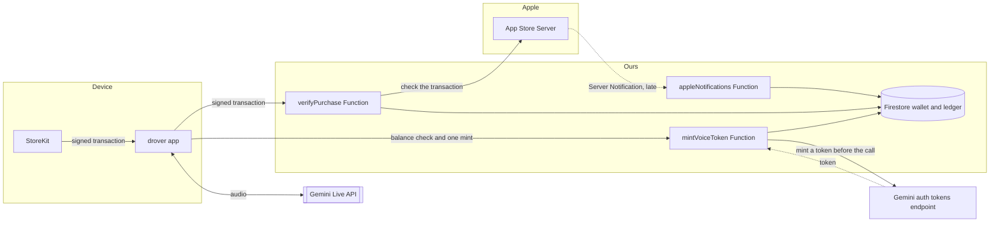
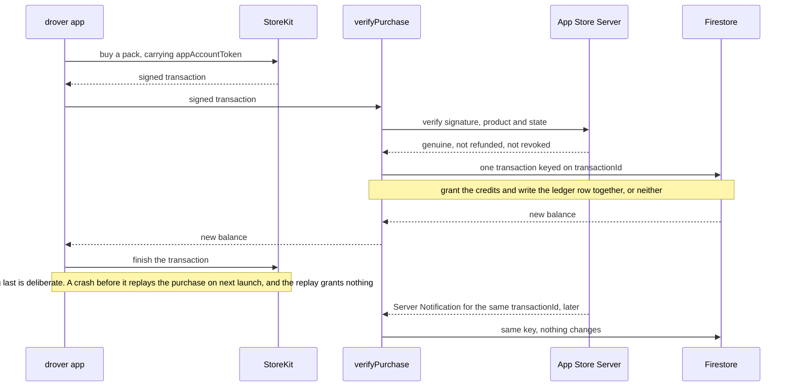
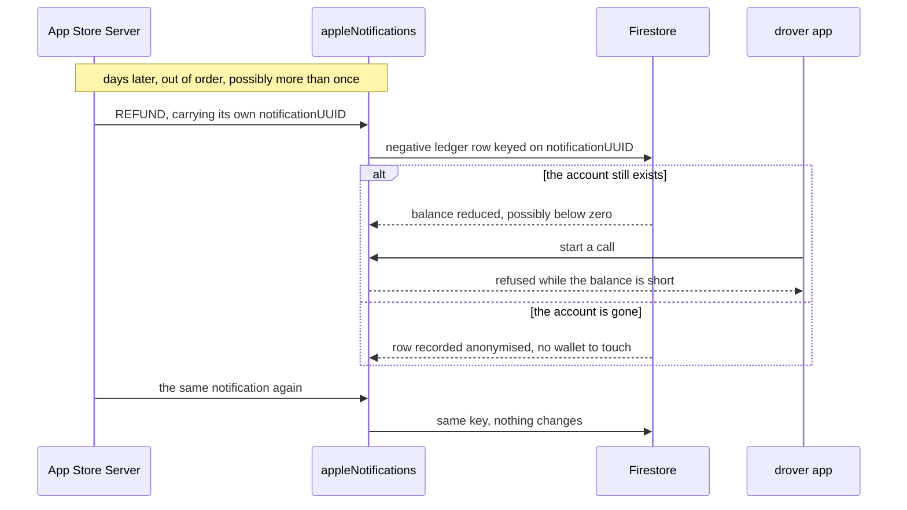
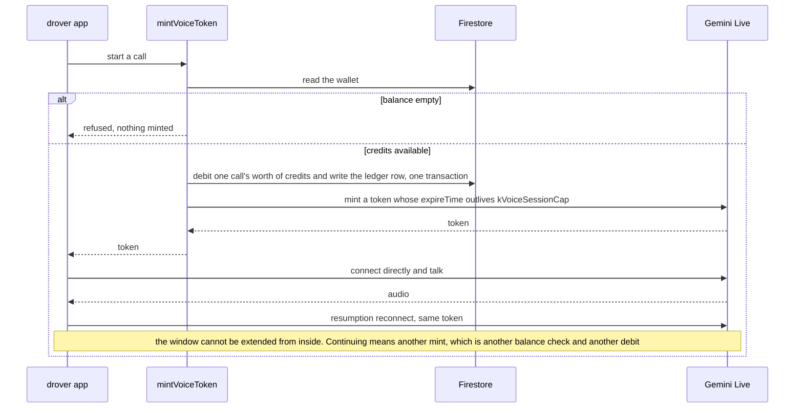

# Charging for voice

A design note, not a built feature. Nothing here is implemented; the voice
assistant is free while it lives on the `voice-live` branch. Written
2026-09-13, revised 2026-09-18 after the ephemeral-token measurements below,
and 2026-09-19 with the four flows drawn.

If voice is ever sold, it is sold as prepaid **Voice Credits** through an Apple
consumable in-app purchase. One piece of backend is needed whatever else is
decided:

- **Firebase Functions v2 + Firestore** for purchase verification, the wallet,
  an immutable ledger, and refunds.

How a session is gated against that wallet is a separate choice, and there are
two designs rather than one:

- **An ephemeral Live API token**, minted by a Function that checks the balance
  first. The app still connects to Gemini itself, with a credential that is
  good for one bounded window. Measured 2026-09-18 and it holds — see "Gating
  a direct connection with an ephemeral token". What it sells is one call: one
  mint grants one window, and nothing inside it can extend it.
- **Cloud Run** as a Voice Gateway: the app connects there instead of to Gemini,
  and the relay meters the session and cuts it off when the balance runs out.
  This is the only design that meters what was actually consumed.

Today the client talks to Firebase AI Logic with no gate at all. That is fine
for a free or invite-only beta, but it is not a boundary anyone can be charged
against. What changes that is a minted token; a relay is required only to sell
consumption rather than calls.

## Shape



Of those boxes only the app, `mintVoiceToken` and Gemini exist today, and the
mint checks nothing but auth and App Check. Everything else is this note.

The only hop we own is the mint, and it happens once, before the call. The
audio itself runs from the device to Gemini with no server of ours in the path
— which is the whole reason the relay below is optional rather than assumed.

## Credits, not minutes

Sell consumables (`drover_voice_credits_<count>`), not a subscription: this is
a prepaid balance that drains with use, it needs no monthly contract or renewal
handling, and the user buys only when they need to.

Denominate in credits rather than minutes. Gemini Live is priced on audio and
text tokens and on accumulated context, so wall-clock time and real cost do not
track each other closely enough to sell by the minute.

The count a pack grants lives in its product id; what a credit *buys* lives on
the server. Apple's product ids are immutable, so a number of minutes baked
into one is a promise the runtime cannot keep — the model changes price, the
cap moves, and the cost of a turn depends on how late in the conversation it
falls. Keeping the conversion server-side means what a credit buys can change
without an App Store release.

Under App Store Review Guideline 3.1.1, purchased credits never expire. The
only thing with an expiry is what a session holds while it runs — a lease
against the balance under the relay design, the minted token itself under the
other.

The ephemeral-token design cuts across this and the tension is real rather than
cosmetic. A minted token bounds a window of time, so time is the only thing it
can meter; but cost is quadratic in turn count (below), so a window of fixed
length costs a variable amount. Under that design the session cap
(`kVoiceSessionCap`) stops being only a safety rail and becomes the thing that
bounds the variance. Credits that drain with measured use need the relay.

## Purchase

StoreKit completes the purchase, the app sends the signed transaction to
Functions, and the server verifies it against the App Store Server API before
crediting the wallet. Only after the wallet write succeeds does the app finish
the StoreKit transaction.

The server checks that Apple's signature is valid, that the product ID is one
of ours, that the transaction ID has not already been processed, that
`appAccountToken` matches the Firebase user, and that the purchase has not been
refunded or revoked. `transactionId` is the idempotency key, so a replay
credits nothing twice.

App Store Server Notifications V2 feed the same ledger code path. Assume they
arrive late, duplicated, and out of order.



Two things that drawing exists to make unmissable: the StoreKit finish comes
*after* the grant, and `transactionId` is the idempotency key — which is what
makes the notification arriving later a no-op rather than a second grant.

## A refund that arrives late

Apple can refund a consumable days after it was bought and spent, and the
notification saying so may land after the user deleted their account.



Money events are idempotent, arrive out of order, and must not require the
account to still exist.

## Identity

Drover uses anonymous auth. That is enough to authenticate against Firebase AI
Logic, but too weak to restore a balance against. So the flow is anonymous on
first launch, Sign in with Apple before the first
purchase, and `appAccountToken` bound to the Firebase UID at purchase time. If
purchasing while anonymous is ever allowed, the app has to say plainly that the
balance may not survive a reinstall or a new device.

Offering Sign in with Apple obliges in-app account deletion, and deletion has
to revoke the Apple token. That turned out to need no key of ours: the app
hands Firebase the authorization code from a reauthentication and Firebase
revokes with Apple itself, from the Sign in with Apple key already configured
on the provider in its console. Decided 2026-09-19: a balance at deletion is
**lost, not refunded**, and the purchase screen says so before the sale rather
than at the end.

Built 2026-09-20, and two details moved. The confirm dialog first shipped
naming no count, because `firestore.rules` denies the client every read and the
device could not see its own balance to quote. Settings has to show that
balance anyway, so a `voiceWallet` callable now reads the wallet and its twenty
newest ledger rows against the auth context — the rules stay shut, and the
Function is the only way through them. The dialog names the number when there
is one to name; a balance that is zero, still loading, or failed to load keeps
the vaguer sentence, so the warning never waits on a round trip to appear. And
the wallet and ledger go with the account rather than staying anonymised — a
refund arriving for a deleted account has nowhere to land and nobody to pay,
which is the price of deleting on request. Revisit when the purchase path
exists, not before.

One thing is open rather than decided. `linkAppleAccount` falls back to signing
in when the Apple ID already belongs to an older Firebase user; that is the
reinstall recovery path, and the anonymous uid created on that launch is
dropped. Harmless today, because nothing hangs off it. Once a wallet exists,
whatever that uid accrued before the user signed in is a merge question.

## Starting a session

Session start *is* the balance check and the debit. There is no other moment at
which either happens.



One mint is one call is one debit. Nothing the client does inside the session
extends it — `kVoiceSessionCap` ends it first, and the token's `expireTime`
ends it regardless — which is why the unit sold is a call rather than a minute.
How many credits a call costs is the server-side conversion above.

## Voice Gateway

Needed only if credits are denominated in consumption rather than in calls
granted; the token design above covers the latter without any of this. Where it
is needed, a paid session runs through Cloud Run rather than straight to Gemini:

```text
1. App connects to Cloud Run
2. Gateway verifies Firebase Auth and App Check
3. Gateway reads the balance from Firestore
4. Gateway reserves credits for the session
5. Gateway opens the Gemini Live connection
6. Audio is relayed over the WebSocket
7. Usage is metered as it goes
8. The session is cut off if the balance runs out
9. On close, actual usage is settled and the unused reservation returned
```

Do not write to Firestore per audio chunk. Reserve a block, top it up while the
session runs, and touch the ledger only at start, top-up and settlement.

Cloud Run rather than Functions because it supports WebSockets and long-lived
connections as a first-class case. It still caps connection lifetime, so the
relay has to implement Live API session resumption and reconnect.

## Firestore model

The wallet and the ledger are needed either way. The reservation fields and
the whole `voiceSessions` collection below belong to the relay: they exist to
settle a session against what it actually consumed, which is the thing a
minted token cannot tell you. Under the token design a session records the
window it was granted instead, and there is nothing to settle.

```text
users/{uid}/wallet
  available
  reserved
  updatedAt

users/{uid}/walletTransactions/{transactionId}
  type: purchase | consume | refund
  credits
  productId
  appleTransactionId
  createdAt

voiceSessions/{sessionId}
  uid
  reservedCredits
  consumedCredits
  status
  startedAt
  endedAt
```

Every balance change happens inside a Firestore transaction, keyed for
idempotency on the Apple transaction ID, the voice session ID, or the
settlement sequence number. A crashed relay leaves a lease behind; the
recovery path is to detect expiry and return the unused reservation.

If a refund lands after the credits were already spent, do not delete history.
Write a negative ledger event; the balance is allowed to go negative, and new
sessions are refused until it is positive again.

## What a long-lived credential cannot enforce

The shortcut — check the balance in Functions, let the client connect to AI
Logic on its own long-lived credential, report usage afterwards — reads like
it works and does not. A modified client skips the check, an old build ignores
whatever limit was added later, the server never sees the audio it is billing
for, and nothing can hang up on a session whose credits ran out. It is fine for
a free beta and unusable as a paywall.

Every one of those failures comes from the same place: the client holds a
credential that outlives the check. An ephemeral token removes exactly that, and
the section below is the measurement. A modified client cannot skip a check it
has to pass to obtain a credential at all; an old build cannot ignore a limit
that is enforced server-side at mint time; and a session does get hung up on,
because the token's expiry ends it in flight — though that hangs up at the end
of a granted window rather than at the moment credits run out, which is a
weaker promise than the relay's. What survives untouched is the third item: the
server still never sees the audio, so it still cannot bill for what was
consumed, only for what was granted.

Underneath that sits a separate limit, about the SDK rather than the design. As
of `firebase_ai` 4.0.0, checked 2026-09-17, the SDK never surfaces
`usageMetadata` on the Live path: `api.dart` parses it for `generateContent`,
but `LiveServerResponse` carries nothing but a `LiveServerMessage`, no variant
of that sealed type holds usage, and the string does not appear in
`live_api.dart`, `live_session.dart` or `live_model.dart` at all. Only a raw
Live WebSocket sees the field. That fact stands, but it does not make the relay
the only possible meter: under the token design the app itself holds the raw
socket, and `usageMetadata` arrives on it normally — confirmed over a token
connection on 2026-09-18. What the relay uniquely offers is a meter the *user's
device does not control*, which is a different property from seeing the number.
Re-check the SDK side against a newer `firebase_ai` before relying on it.

## Gating a direct connection with an ephemeral token

Measured 2026-09-18 against `models/gemini-3.1-flash-live-preview`, minting on
`v1alpha` and connecting on `v1beta`, with `app/tool/token_probe.dart`. A
Function can check the wallet and mint a short-lived Live API token; the app
connects to Google with it and no relay sits in the audio path.

**`uses` counts session starts, not messages, and a resumption reconnect does
not consume one.** This is the trap that would quietly make a wallet check
useless. Three turns ran fine on a `uses: 1` token; a second connect without a
resumption handle was refused with `1011 "Token has been used too many times"`.
But the same spent token kept accepting reconnects that carried a resumption
handle, one after another, with the context growing each time. Do not treat
`uses` as a budget — it bounds only the first unhandled connect.

**`expireTime` is the real boundary.** It ends a session already in flight: a
session taking a turn every twenty seconds across its token's expiry was closed
by the server within a second of the stated time, with `1011 "auth token has
expired"`, and nothing after that was answered. It also refuses resumption
afterwards — reconnecting on a valid handle with the expired token gave `1011
"Token has expired"`. A freshly minted token resumed the same handle
immediately, and the conversation's context was still there. The mint will not
issue a token living longer than 20 hours (`expire_time is too far in the
future. Maximum lifetime is 20h`).

**So a mint is a genuine meter tick.** Each one grants exactly the window it was
minted for, the client cannot extend that window from inside it, and
continuing past it means coming back through the Function — which is another
balance check. The unit this can sell is a granted window — one call — not
tokens consumed.

**Session resumption survives all of it**, including being handed to a token
that did not create the handle. The app's existing reconnect
(`VoiceSession`) is compatible with a paid path; this was the risk that would
have killed the design outright, and it did not materialise.

What it does not give you is a closed loop. One granted window is a blank cheque
at whatever rate the client drives it, and there is no usage API on the token
resource at all — list and get, on both API versions, all return 404 with an
empty body. Reconciliation can therefore only come from the Cloud Billing
export, after the fact.

Two things the official documentation gets wrong, both of which cost an hour to
find and neither of which is written down anywhere else:

- An ephemeral token is **not** accepted on the `BidiGenerateContent` RPC that
  an API key uses. It goes to **`BidiGenerateContentConstrained`**, with the
  token's resource name in an `?access_token=` query parameter. Every form the
  docs suggest — `access_token` on the plain RPC, an `Authorization: Token`
  header, the token as an API key — is rejected, on both API versions.
- The mint field the docs call `liveConnectConstraints` does not exist over
  REST; sending it is a 400. The real field is **`bidiGenerateContentSetup`**
  plus a **`fieldMask`** naming which of its fields are frozen. That lock is
  enforced: on a token whose `model` is masked, a setup asking for a model that
  does not exist still connects, while the same request on an unconstrained
  token is refused with `1008 "models/... is not found"`. The client's value is
  ignored rather than honoured, which is what makes it a real constraint.

Re-check all of this before relying on it; ephemeral tokens are a preview
feature of a preview API, and the documentation is already out of step with the
behaviour.

## Before setting a price

Measure first: input audio tokens, output audio tokens, input and output text
tokens, session length, usage after context compression, Cloud Run's
concurrency and egress, and the gap between reported usage and what Cloud
Billing settles at. None of it is visible through `firebase_ai`, for the reason
above — it takes either a raw Live WebSocket, which both the relay and the
token design end up holding, or cost deltas read out of the billing export. See
[billing-cli-setup.md](billing-cli-setup.md) for the latter.

Two probes do this already, neither of them throwaway work:
`app/tool/live_probe.dart` opens the raw Live WebSocket, bypassing
`firebase_ai`, and dumps every `usageMetadata` verbatim;
`app/tool/token_probe.dart` does the same over an ephemeral token and is where
the section above was measured.

What `live_probe.dart` measured against `gemini-3.1-flash-live-preview` on
2026-09-18, over five text-input turns with audio responses: **accumulated
context is re-billed at the modality it arrived in.** Each turn's
`promptTokensDetails` carried an AUDIO count equal to the running sum of every
prior response's audio tokens — 25, then 48, then 71, then 96 — while its
TEXT count grew separately. Audio history stays audio; it is not folded into
text. That was the open question, and it resolved to the expensive branch.

A separate single audio-input turn reported a prompt of TEXT 132 + AUDIO 72
for 2.95 s of speech — about **25 tokens per second of input audio** — and a
response of AUDIO 263 whose duration was not captured, so the output rate is
assumed symmetric until it is. The user's own speech therefore enters the
prompt as audio, and by the rule above is re-billed as audio for the rest of
the session.

The consequence that matters for pricing: a session's cost is **quadratic in
turn count**, at the audio rate, because every turn re-pays for all the audio
before it. This is why a credit cannot be denominated in minutes — the same
minute costs more the later in a conversation it falls. The session cap
(`kVoiceSessionCap`) is what bounds the quadratic.

Not yet measured: a multi-turn run with real audio *input*. Those runs are
closed by the server with `1008 The operation was aborted.` while text turns
succeed at the same moment, so it is not quota; the cause is unknown after
three attempts, most likely the VAD/activity signalling. It does not affect
the re-billing conclusion, but no end-to-end figure for a real session exists
yet. Nor does the check against Cloud Billing that this note asks for — the
billing export's tables stop at 2026-08-23 and have no September rows.

Re-check all of this against a newer model before relying on it; the behaviour
above is that of a preview model and may change.

The price then has to cover the Gemini cost plus Apple's cut, Firebase and
Cloud Run, headroom for refunds and abuse, and headroom for model price and
exchange-rate moves.

`gemini-3.1-flash-live-preview` is a preview model. Confirm a stable Live model
is available before selling anything against it; while it is still preview,
voice stays on an invite-only TestFlight beta.

## Order of work

Free beta first: measure the real cost, turn on AI monitoring and the billing
export, and verify the production App Check configuration. Explicit consent for
sending audio to an AI service and a session cap both shipped in #254. Then the
billing control plane — `in_app_purchase`, consumable products, transaction
verification, `appAccountToken` binding, the wallet and ledger, Server
Notifications V2, refund and revoke handling. Then the gate: a Function that
checks the balance and mints an ephemeral token per call, which is a small
piece of work and enough to sell calls.

The Cloud Run relay is no longer on that path. It is what you build if credits
have to be denominated in consumption — the relay itself, auth and App Check
checks, reserve/settle/return, stored `usageMetadata`, disconnect on empty
balance, crash recovery, and a daily reconciliation against Cloud Billing. That
is a large, always-on service in the audio path, so decide what is being sold
before committing to it. Whatever ships is validated in the StoreKit sandbox and
on TestFlight.

## References

- [App Store Review Guidelines 3.1.1](https://developer.apple.com/app-store/review/guidelines/)
- [App Store Server API](https://developer.apple.com/documentation/appstoreserverapi)
- [App Store Server Notifications](https://developer.apple.com/documentation/appstoreservernotifications)
- [Cloud Run WebSockets](https://cloud.google.com/run/docs/triggering/websockets)
- [Live API ephemeral tokens](https://ai.google.dev/gemini-api/docs/live-api/ephemeral-tokens)
  — wrong about how a token is presented; see the section above.
